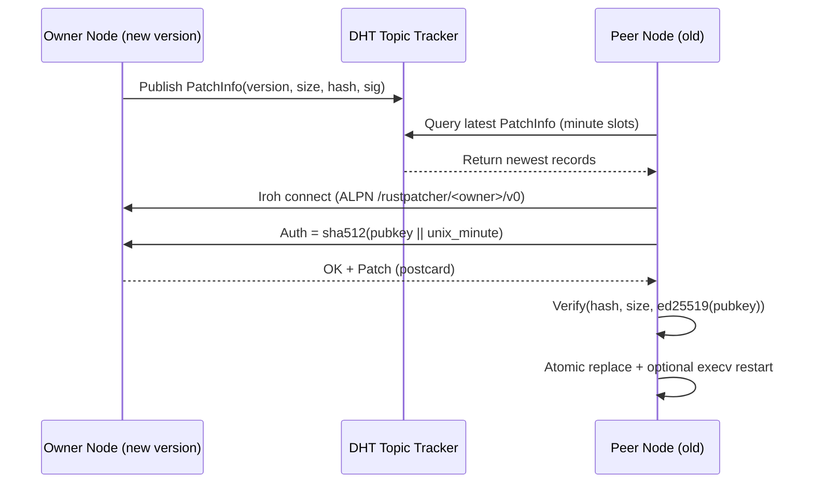

[](https://crates.io/crates/rustpatcher)
[](https://docs.rs/rustpatcher)


# Rust Patcher
Secure fully decentralized software updates.


## Implementation Flow

### 1. Add dependency
```toml
# Cargo.toml
[dependencies]
rustpatcher = "0.2"
rustpatcher-macros = "0.2"
tokio = { version = "1", features = ["rt-multi-thread","macros"] }
```

### 2. Embed owner public key and start the updater
```rust

#[tokio::main]
#[rustpatcher::public_key("axegnqus3miex47g1kxf1j7j8spczbc57go7jgpeixq8nxjfz7gy")]
async fn main() -> anyhow::Result<()> {

    // Only in --release builds, not intended for debug builds
    rustpatcher::spawn(rustpatcher::UpdaterMode::At(13, 40)).await?;

    println!("my version is {:?}", rustpatcher::Version::current()?);
    
    // your app code after this
    loop {
        tokio::select! {
            _ = tokio::signal::ctrl_c() => {
                println!("Exiting on Ctrl-C");
                break;
            }
        }
    }
    Ok(())
}
```

### 3. Generate signing key (one-time)
```bash
cargo install rustpatcher
rustpatcher gen ./owner_key
```
Output includes:
- Owner signing key saved to ./owner_key (z-base-32 encoded)
- Owner public key (z-base-32)
- Attribute snippet to paste into main: #[rustpatcher::public_key("<pubkey>")]

### 4. Build and sign releases
```bash
# build your binary
cargo build --release

# sign the compiled binary in-place
rustpatcher sign target/release/<your-bin> --key-file=./owner_key
```

### 5. Publish updates
- Run the newly signed binary on at least one node until a couple of peers have updated themselfs.
- The running process periodically publishes the latest PatchInfo to the DHT.
- Clients discover new PatchInfo, fetch the patch from peers, verify, and self-replace.


---

## Run Example: simple
```sh
git clone https://github.com/rustonbsd/rustpatcher
cd rustpatcher
cargo build --release --example simple
cargo run --bin rustpatcher sign target/release/examples/simple --key-file ./owner_key_example

# Run signed app:
./target/release/examples/simple


# if you increase the version in /crates/rustpatcher/Cargo.toml  
# and build+sign+start another node, then the first 
# node will update via the second node.
```

---

## Network Architecture



- Discovery: [distributed-topic-tracker](https://github.com/rustonbsd/distributed-topic-tracker) minute-slotted records over the DHT
- Transport: [iroh](https://github.com/n0-computer/iroh) QUIC, ALPN namespaced per owner key
- Authentication: rotating hash auth per minute bucket

---

## Key Processes

1. Version propagation
- Running a node publishes a PatchInfo record roughly every minute.
- Records are minute scoped with short TTL to avoid staleness.
- Peers scan current and previous minute for latest version.

2. Patch fetch + verification
- Peer connects to other peers with newer version via iroh using an ALPN derived from the owner pubkey.
- Auth: sha512(owner_pub_key || unix_minute(t)) for t ∈ {-1..1}.
- Owner sends the signed patch (postcard-encoded).

3. Self-update mechanism
- Write to temp file
- Atomic [self-replace](https://crates.io/crates/self-replace)
- Optional immediate restart via execv (UpdaterMode::Now) or deferred (OnRestart / At(hh, mm))

---

## Data Embedded in the Binary

- Fixed-size embedded region in a dedicated link section (.embedded_signature)
- Layout:
  - 28 bytes: bounds start marker
  - 32 bytes: binary hash (sha512 truncated to 32)
  - 8 bytes: binary size (LE)
  - 64 bytes: ed25519 signature
  - 16 bytes: ASCII version (padded)
  - 28 bytes: bounds end marker

At runtime, the library:
- Locates the embedded region
- Parses version/hash/size/signature
- Verifies the binary contents against the signed metadata

---

## CLI Reference (rustpatcher)

- gen <key-path>
  - Generates a new ed25519 signing key in z-base-32; prints the public key and attribute snippet.
- sign <binary> --key-file <key-path>
  - Reads the compiled binary, computes PatchInfo, and writes it into the embedded region.

DO NOT COMMIT YOUR PRIVATE KEY!

```sh
# add this to your .gitignore
owner_key*
```

Notes:
- Keys are z-base-32 encoded on disk, the public key is embedded in code via #[rustpatcher::public_key("...")].
- Signing must be re-run after each new build that is intendet to self update.
- For every build target a seperate keypair is required (we don't want the arm users patching in x86 binaries).

---

## Library API (overview)

- #[rustpatcher::public_key("<zbase32-ed25519-pubkey>")]
  - Embeds the owner public key and the package version for verification
- rustpatcher::spawn(mode: UpdaterMode) -> Future<Result<()>>
  - Starts discovery, publishing, distribution server, and updater
- UpdaterMode::{Now, OnRestart, At(h, m)}

---

## How It Changed (vs previous rustpatcher)

- Single embedded region with explicit bounds, constant size, and zero-allocation compile-time construction
- Signature scheme clarified and minimal:
  - sha512(data_no_embed) -> first 32 bytes as hash
  - sign sha512(version || hash || size_le) with ed25519
- Owner key embedding via attribute macro, version captured from CARGO_PKG_VERSION and embedded as fixed-length ASCII
- Minute-slotted record publishing and discovery via distributed-topic-tracker
- iroh-based distributor with rotating minute auth derived from owner public key
- Simple updater modes: Now, OnRestart, At(hh:mm)
- CLI split: cargo install rustpatcher to manage keys and sign releases

---

## Example

```rust
use rustpatcher::UpdaterMode;

#[tokio::main]
#[rustpatcher::public_key("axegnqus3miex47g1kxf1j7j8spczbc57go7jgpeixq8nxjfz7gy")]
async fn main() -> anyhow::Result<()> {

    rustpatcher::spawn(UpdaterMode::At(02, 30)).await?;

    // app code...
    Ok(())
}
```

## Release Workflow

1) Generate key (once):
- rustpatcher gen ./owner_key

2) Build + sign each release:
- cargo build --release
- rustpatcher sign target/release/<your-bin> --key-file=./owner_key

3) Deploy and run the signed binary on at least one node:
- It will publish PatchInfo and serve patches to peers.
- No need to have any exposed ports.

```make
build:
    cargo build --release
    rustpatcher sign target/release/<your-bin> --key-file ./owner_key

publish:
    target/release/<your-bin>
```
