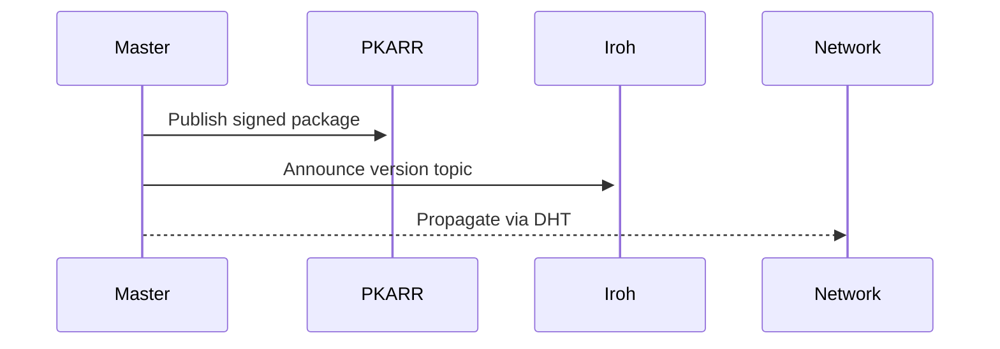
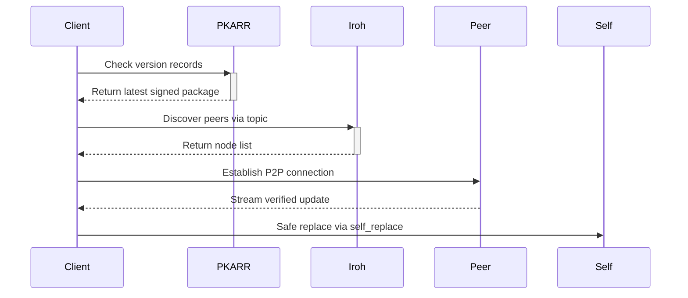

# Rust Patcher  
*Secure Decentralized Software Updates*  -  Working work in progress

[](https://crates.io/crates/rustpatcher)
[](https://docs.rs/rustpatcher)


## Implementation Flow  

### 1. Add Dependency (Crates.io)  
```toml
# Cargo.toml
[dependencies]
rustpatcher = "0.1"
```


### 2. Initialize Patcher
```rust
// main.rs
use rustpatcher::Patcher;

#[rustpatcher::main]
#[tokio::main]
async fn main() -> anyhow::Result<()> {
    let patcher = Patcher::new()
        .build()
        .await?;
}
```

### 3. Initialize Cryptographic Identity  
```bash
cargo run -- rustpatcher init
```
**Output:**  
```text
New keys generated:
  Trusted-Key = mw6iuq1iu7qd5gcz59qpjnu6tw9yn7pn4gxxkdbqwwwxfzyziuro
  Shared-Secret = 8656fg8j6s43a4jndkzdysjuof588zezsn6s8sd6wwcpwf6b3r9y
```

### 4. Extend main with keys
```rust
// main.rs
use rustpatcher::Patcher;

#[rustpatcher::main]
#[tokio::main]
async fn main() -> anyhow::Result<()> {
    let patcher = Patcher::new()
        .trusted_key_from_z32_str("mw6iuq1iu7qd5gcz59qpjnu6tw9yn7pn4gxxkdbqwwwxfzyziuro")
        .shared_secret_key_from_z32_str("mw6iuq1iu7qd5gcz59qpjnu6tw9yn7pn4gxxkdbqwwwxfzyziuro"))
        .build()
        .await?;
}
```

### 5. Publish Updates (Master Node)  
```bash
# Increment version in Cargo.toml first
cargo run -- rustpatcher publish
```
Creates signed package with:  
- SHA-256 executable hash  
- Version metadata (major.minor.patch)  
- Ed25519 publisher signature  
- PKARR DHT record  

---

## Network Architecture  

### Master Node Flow  


### Client Node Flow  


## Key Processes  

1. **Version Propagation**  
   - Master nodes sign packages with secret key  
   - PKARR DHT stores version records with TTL  
   - Iroh topic tracker maintains peer list per version  

2. **Update Verification**  
   ```rust
   // Verification chain
   if pub_key.verify(&data, &sig).is_ok() 
      && compute_hash(data) == stored_hash 
      && version > current_version {
       apply_update()
   }
   ```

3. **Self-Update Mechanism**
   - Hash and Signature verification after data download
   - Temp file write with atomic replacement  
   - Execv syscall for instant reload  

## CLI Reference  

| Command         | Function                             |
|-----------------|--------------------------------------|
| `init`          | Generate cryptographic identity     |
| `publish`       | Create/distribute signed package    |

*Zero configuration needed for peer discovery - automatic via Iroh Topic Tracker*

## Old Architecture Diagram

